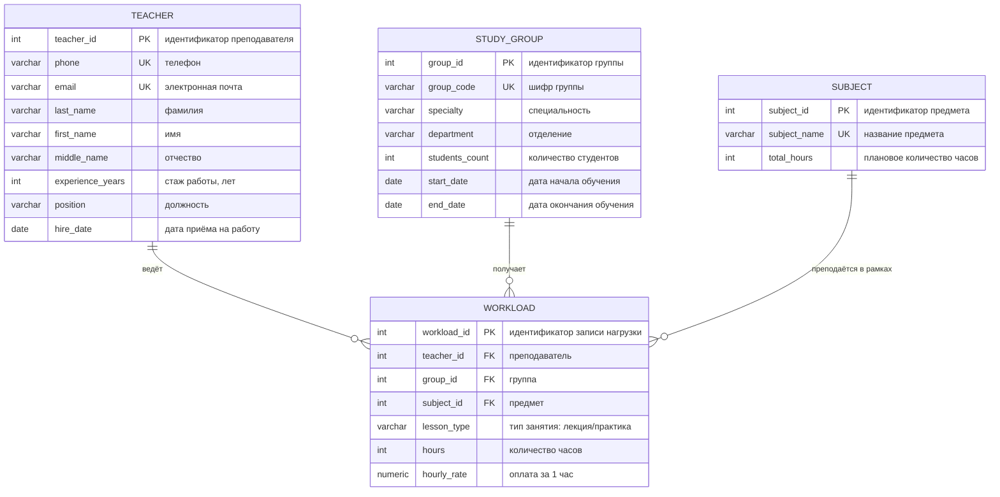

# Курсы повышения квалификации — ER-модель и диаграмма классов

## 1. Описание предметной области

Учебное заведение организует курсы повышения квалификации.

- Слушатели объединяются в **группы**: группа формируется по специальности и отделению, известно количество студентов в ней.
- Занятия ведёт штат **преподавателей**: для каждого хранятся анкетные данные (ФИО, телефон) и стаж работы.
- По итогам распределения **нагрузки** известно, сколько часов занятий проводит каждый преподаватель с конкретной группой, по какому **предмету**, какого **типа занятия** (лекция / практика) и какова оплата за 1 час.

## 2. Сущности

| Сущность | Тип | Назначение |
|---|---|---|
| `Teacher` (Преподаватель) | независимая | анкетные данные и стаж преподавателя |
| `StudyGroup` (Группа) | независимая | сформированная группа слушателей |
| `Subject` (Предмет) | независимая | справочник дисциплин |
| `Workload` (Нагрузка) | зависимая (ассоциативная) | кто, кому, что, каким типом занятия ведёт и по какой ставке |

Связи:

- `Teacher 1 — 0..* Workload` — преподаватель может вести много записей нагрузки;
- `StudyGroup 1 — 0..* Workload` — группе назначено много записей нагрузки;
- `Subject 1 — 0..* Workload` — предмет встречается во многих записях нагрузки;
- `Workload` разрешает связь «многие-ко-многим» между преподавателем, группой и предметом и хранит собственные атрибуты (часы, тип занятия, ставка).

## 3. ER-диаграмма



## 4. Логическая модель

### 4.1. `teacher` — Преподаватель

| Поле | Тип | Ограничения | Описание |
|---|---|---|---|
| `teacher_id` | `SERIAL` | `PK` | суррогатный первичный ключ |
| `last_name` | `VARCHAR(50)` | `NOT NULL` | фамилия |
| `first_name` | `VARCHAR(50)` | `NOT NULL` | имя |
| `middle_name` | `VARCHAR(50)` | | отчество |
| `phone` | `VARCHAR(20)` | `NOT NULL`, `UNIQUE` | телефон |
| `email` | `VARCHAR(100)` | `UNIQUE` | электронная почта |
| `experience_years` | `INTEGER` | `NOT NULL`, `>= 0` | стаж работы, лет |
| `position` | `VARCHAR(50)` | | должность (ассистент/доцент/профессор) |
| `hire_date` | `DATE` | `NOT NULL` | дата приёма на работу |

### 4.2. `study_group` — Группа

| Поле | Тип | Ограничения | Описание |
|---|---|---|---|
| `group_id` | `SERIAL` | `PK` | суррогатный первичный ключ |
| `group_code` | `VARCHAR(20)` | `NOT NULL`, `UNIQUE` | шифр группы |
| `specialty` | `VARCHAR(100)` | `NOT NULL` | специальность |
| `department` | `VARCHAR(100)` | `NOT NULL` | отделение |
| `students_count` | `INTEGER` | `NOT NULL`, `> 0` | количество студентов |
| `start_date` | `DATE` | `NOT NULL` | дата начала обучения |
| `end_date` | `DATE` | `> start_date` | дата окончания обучения |

### 4.3. `subject` — Предмет

| Поле | Тип | Ограничения | Описание |
|---|---|---|---|
| `subject_id` | `SERIAL` | `PK` | суррогатный первичный ключ |
| `subject_name` | `VARCHAR(100)` | `NOT NULL`, `UNIQUE` | название предмета |
| `total_hours` | `INTEGER` | `> 0` | плановое количество часов по предмету |

### 4.4. `workload` — Нагрузка

| Поле | Тип | Ограничения | Описание |
|---|---|---|---|
| `workload_id` | `SERIAL` | `PK` | суррогатный первичный ключ |
| `teacher_id` | `INTEGER` | `FK → teacher`, `NOT NULL` | преподаватель |
| `group_id` | `INTEGER` | `FK → study_group`, `NOT NULL` | группа |
| `subject_id` | `INTEGER` | `FK → subject`, `NOT NULL` | предмет |
| `lesson_type` | `VARCHAR(20)` | `NOT NULL`, `CHECK IN ('LECTURE','PRACTICE')` | тип занятия |
| `hours` | `INTEGER` | `NOT NULL`, `> 0` | количество часов |
| `hourly_rate` | `NUMERIC(10,2)` | `NOT NULL`, `> 0` | оплата за 1 час |

Альтернативный ключ: `UNIQUE (teacher_id, group_id, subject_id, lesson_type)`.

## 5. Обоснование нормальных форм

**1НФ.** Все атрибуты атомарны: ФИО разбито на три поля, повторяющихся групп значений и массивов нет, в каждой таблице задан первичный ключ.

**2НФ.** Все неключевые атрибуты полностью зависят от первичного ключа. В `teacher`, `study_group`, `subject` ключ простой (один столбец), поэтому частичных зависимостей возникнуть не может. В `workload` ключ тоже простой (`workload_id`), а `hours` и `hourly_rate` имеют смысл только для конкретной комбинации «преподаватель + группа + предмет + тип занятия».

**3НФ.** Транзитивных зависимостей нет:

- в `teacher` стаж, телефон и должность зависят только от `teacher_id`, а не друг от друга;
- в `study_group` специальность не определяет отделение и наоборот — оба атрибута зависят только от `group_id`;
- в `workload` ставка задаётся индивидуально для конкретной записи нагрузки, а не выводится из `lesson_type`.

> Если по правилам учреждения ставка зависит **только от типа занятия**, возникает функциональная зависимость `lesson_type → hourly_rate`, нарушающая 3НФ (транзитивная зависимость через неключевой атрибут). В этом случае нужно вынести справочник `lesson_type (lesson_type_id, type_name, hourly_rate)` — модель станет пятитабличной.

## 6. DDL (PostgreSQL)

```sql
CREATE TABLE teacher (
    teacher_id       SERIAL PRIMARY KEY,
    last_name        VARCHAR(50)  NOT NULL,
    first_name       VARCHAR(50)  NOT NULL,
    middle_name      VARCHAR(50),
    phone            VARCHAR(20)  NOT NULL UNIQUE,
    email            VARCHAR(100) UNIQUE,
    experience_years INTEGER      NOT NULL CHECK (experience_years >= 0),
    position          VARCHAR(50),
    hire_date        DATE         NOT NULL
);

CREATE TABLE study_group (
    group_id       SERIAL PRIMARY KEY,
    group_code     VARCHAR(20)  NOT NULL UNIQUE,
    specialty      VARCHAR(100) NOT NULL,
    department     VARCHAR(100) NOT NULL,
    students_count INTEGER      NOT NULL CHECK (students_count > 0),
    start_date     DATE         NOT NULL,
    end_date       DATE,
    CHECK (end_date IS NULL OR end_date > start_date)
);

CREATE TABLE subject (
    subject_id   SERIAL PRIMARY KEY,
    subject_name VARCHAR(100) NOT NULL UNIQUE,
    total_hours  INTEGER CHECK (total_hours > 0)
);

CREATE TABLE workload (
    workload_id SERIAL PRIMARY KEY,
    teacher_id  INTEGER       NOT NULL REFERENCES teacher(teacher_id) ON DELETE CASCADE,
    group_id    INTEGER       NOT NULL REFERENCES study_group(group_id) ON DELETE CASCADE,
    subject_id  INTEGER       NOT NULL REFERENCES subject(subject_id),
    lesson_type VARCHAR(20)   NOT NULL CHECK (lesson_type IN ('LECTURE', 'PRACTICE')),
    hours       INTEGER       NOT NULL CHECK (hours > 0),
    hourly_rate NUMERIC(10,2) NOT NULL CHECK (hourly_rate > 0),
    UNIQUE (teacher_id, group_id, subject_id, lesson_type)
);
```
