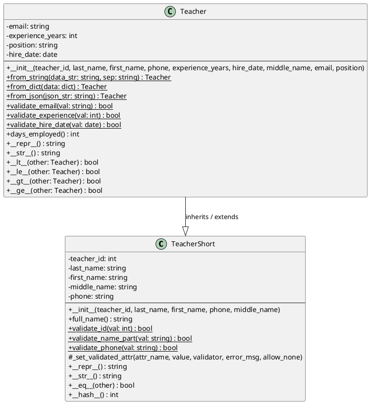

# UML-диаграмма классов: TeacherShort / Teacher

## Пояснения к обозначениям

- `-` — приватное поле (private)
- `+` — публичный метод (public)
- `#` — защищённый метод (protected)
- `{static}` — статический метод (`@staticmethod`)
- `Тип возврата` указывается через двоеточие после сигнатуры метода
- `--` — разделитель между разделом полей и разделом методов внутри блока класса
- `Teacher --|> TeacherShort` — сплошная линия с треугольной стрелкой — отношение наследования (`extends`) в PlantUML
